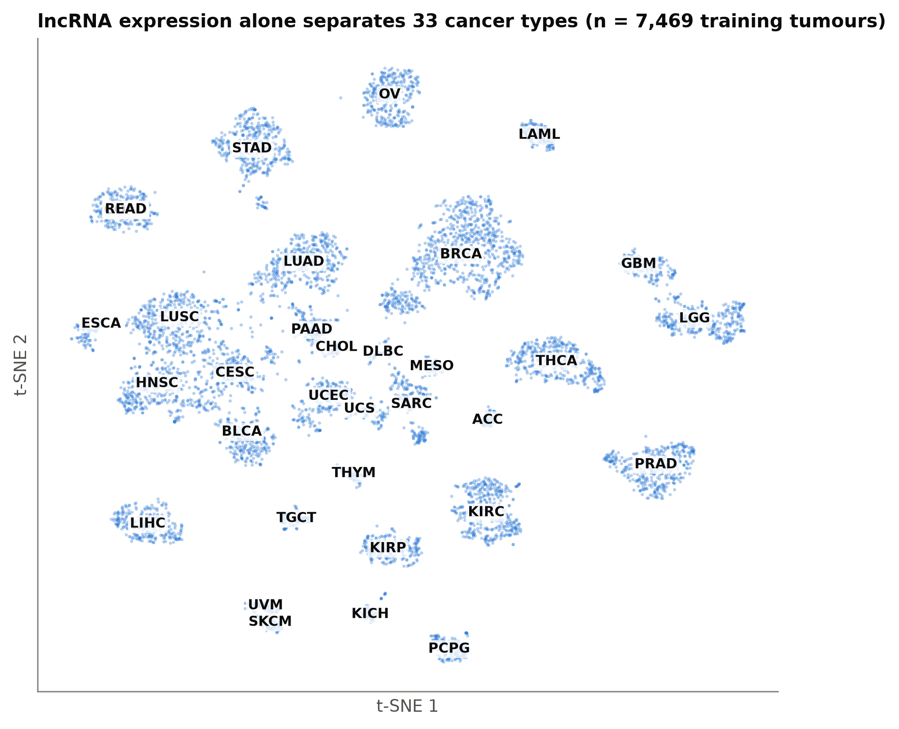
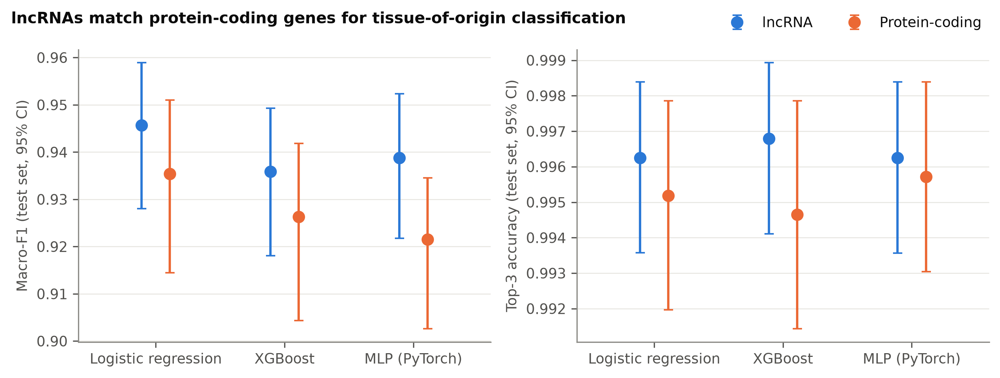
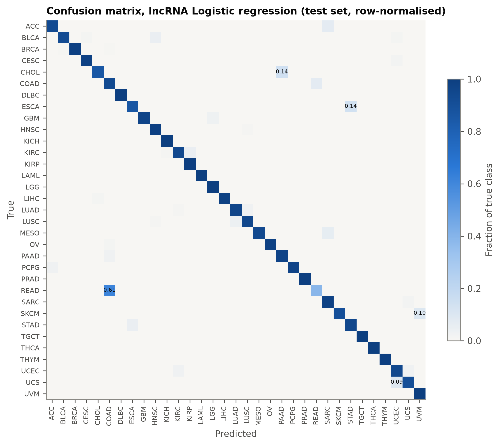
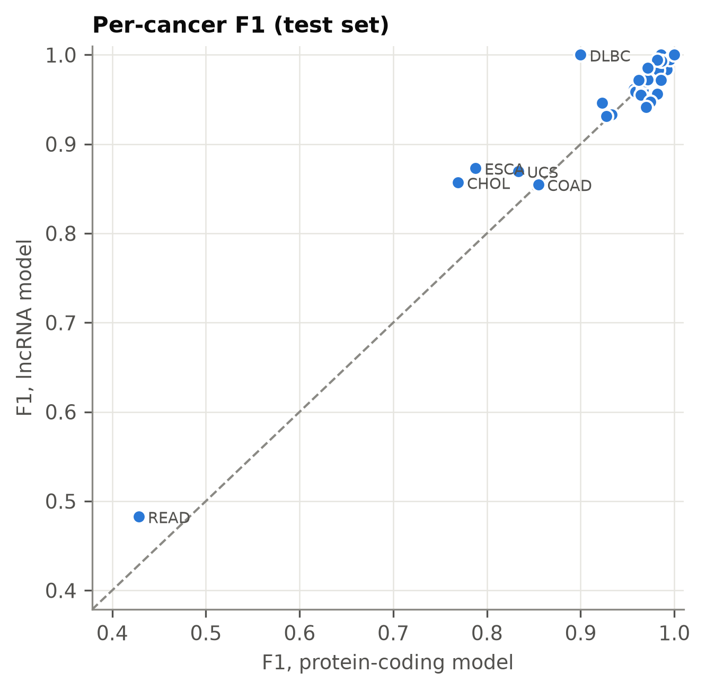
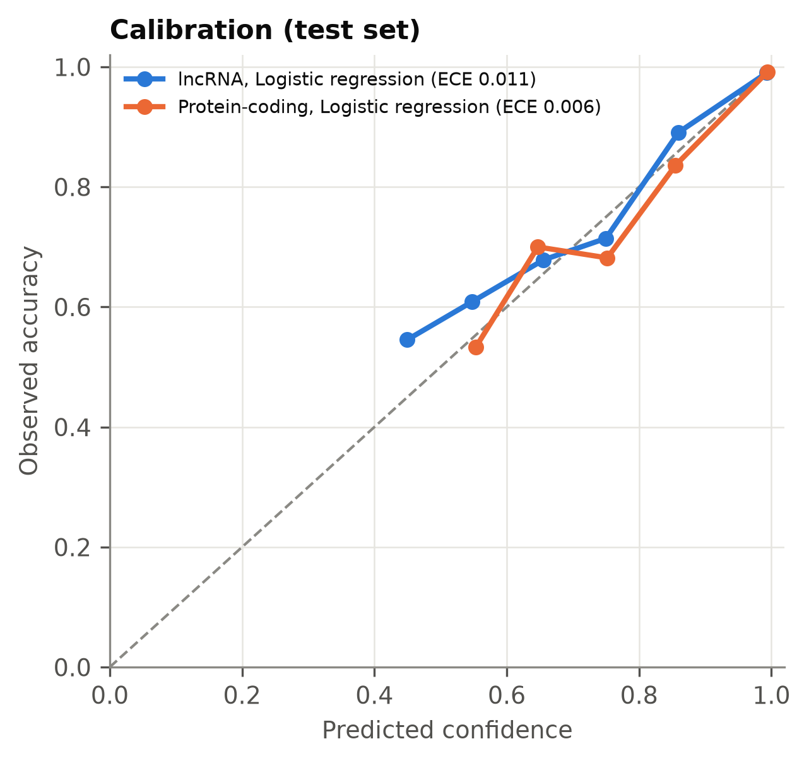
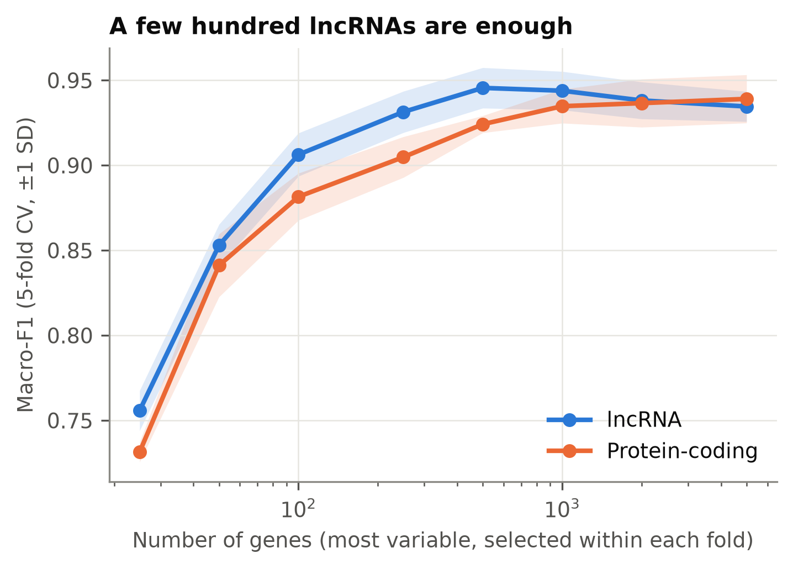
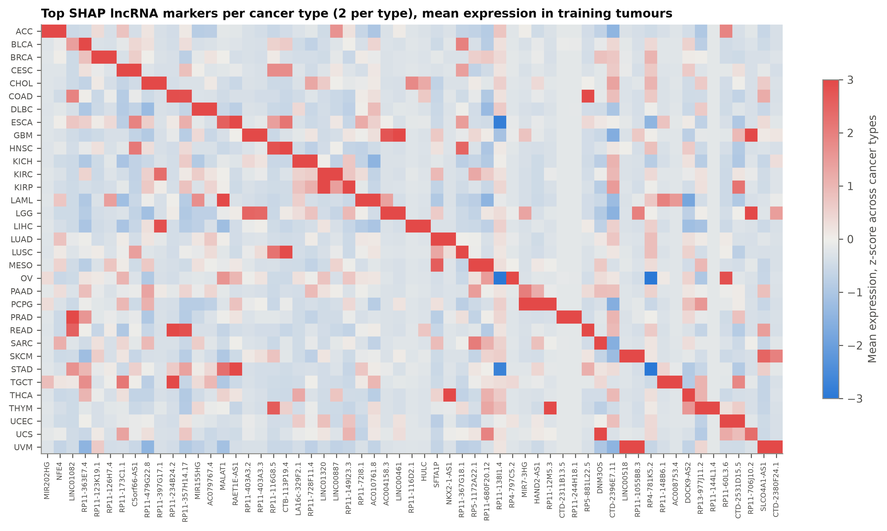

# lncRNA-only pan-cancer tissue-of-origin classification

**Can long non-coding RNAs alone tell which organ a tumour came from?**

I spent the last year of my undergraduate degree on a single lncRNA, *LINC01561*, in
colorectal cancer: TCGA analysis, qPCR on patient tissue, siRNA knockdown. What stayed with me
was how *tissue-specific* lncRNAs are compared with most protein-coding genes
([Yan et al., 2015](https://doi.org/10.1016/j.ccell.2015.09.006)). This project asks whether
that specificity is strong enough to identify a tumour's tissue of origin from lncRNAs alone.

The question has a clinical side. In 3–5% of patients the cancer is found as metastases and
the primary site is never located (*cancer of unknown primary*); expression-based classifiers
have been proposed to help ([Grewal et al., 2019](https://doi.org/10.1001/jamanetworkopen.2019.2597)),
but they are built on protein-coding genes.

**Short answer:** yes. On 9,337 TCGA tumours from 33 cancer types, lncRNA-only models are at
least as accurate as protein-coding models, need fewer genes to get there, and recognise the
tissue of origin of metastases from patients they have never seen.

## Key results

| | Result |
|---|---|
| **Accuracy** | lncRNA-only logistic regression: **macro-F1 0.946** (95% CI 0.928–0.959), accuracy 0.966, **top-3 accuracy 0.996** on 1,868 held-out tumours, 33 classes |
| **lncRNA vs protein-coding** | lncRNA models are at least as accurate as protein-coding models for all three classifiers (Δ macro-F1 +0.010 to +0.017; paired bootstrap p = 0.09, 0.27, 0.02) |
| **Feature budget** | **500 lncRNAs** reach CV macro-F1 0.946 vs 0.924 for 500 protein-coding genes; lncRNAs carry more tissue signal per gene at small budgets |
| **Metastases (external)** | Models trained only on primaries (82 melanomas) assign **93%** of 364 melanoma metastases from unseen patients to skin (top-3: 97%) |
| **Calibration** | Logistic regression and XGBoost are well calibrated (ECE ≈ 0.01) |
| **Biology** | SHAP recovers known tissue-restricted lncRNAs, e.g. *LINC00518* for melanoma, a gene in a clinical non-invasive melanoma assay ([Gerami et al., 2014](https://doi.org/10.1016/j.jaad.2014.04.042)), and *PTCSC3* and *NKX2-1-AS1* for thyroid ([Jendrzejewski et al., 2012](https://doi.org/10.1073/pnas.1205654109)) |

<p align="center"></p>

### Benchmark (held-out test set, n = 1,868; bootstrap 95% CIs)

| Genes | Model | Macro-F1 | Balanced acc. | Top-3 acc. | Log-loss | ECE |
|---|---|---|---|---|---|---|
| lncRNA | Logistic regression | **0.946** (0.928–0.959) | **0.946** | 0.996 | **0.101** | 0.011 |
| lncRNA | XGBoost | 0.936 (0.918–0.949) | 0.939 | **0.997** | 0.121 | **0.008** |
| lncRNA | MLP (PyTorch) | 0.939 (0.922–0.952) | 0.942 | 0.996 | 0.160 | 0.051 |
| protein-coding | Logistic regression | 0.935 (0.914–0.951) | 0.937 | 0.995 | 0.108 | 0.006 |
| protein-coding | XGBoost | 0.926 (0.904–0.942) | 0.928 | 0.995 | 0.130 | 0.011 |
| protein-coding | MLP (PyTorch) | 0.922 (0.903–0.935) | 0.925 | 0.996 | 0.144 | 0.032 |

Each model uses the 2,000 most variable genes of its universe; hyperparameters were chosen by
5-fold CV on the training split only (`results/tables/search__*.json`).



**The linear model wins.** I expected XGBoost or the MLP to come out on top; they don't. With
~7,500 training tumours and features this tissue-specific, extra model capacity buys nothing,
and the regularised linear model is also the best calibrated. The MLP's higher ECE is mostly
label smoothing, which softens its probabilities on purpose.

### Where the errors are



Almost all errors fall between cancers that share a tissue or cell of origin: **rectum vs
colon** (READ is mostly called COAD; TCGA found non-hypermutated colon and rectal cancers to be
molecularly indistinguishable, [TCGA Network, 2012](https://doi.org/10.1038/nature11252)),
oesophagus vs stomach, cholangiocarcinoma vs pancreas, and uterine carcinosarcoma vs
endometrial carcinoma. The same pairs are the hardest for protein-coding models (below), so
they reflect biology rather than a weakness specific to lncRNAs.

<p align="center">


</p>

### How many lncRNAs are needed?

<p align="center"></p>

Performance saturates at ~500 lncRNAs. At every budget up to 500 genes, lncRNAs beat the
same number of protein-coding genes, which suggests that a compact lncRNA panel could carry
most of the tissue-of-origin signal.

### Generalisation to metastases

364 TCGA melanoma metastases (lymph node, skin and distant sites) from patients whose primary
tumour was *not* in the cohort were classified by models trained only on primary tumours:

| Genes | Model | Accuracy (95% CI) | Top-3 accuracy |
|---|---|---|---|
| lncRNA | Logistic regression | 0.929 (0.904–0.953) | 0.964 |
| lncRNA | MLP (PyTorch) | **0.934** (0.909–0.959) | **0.973** |
| lncRNA | XGBoost | 0.901 (0.871–0.931) | 0.951 |
| protein-coding | Logistic regression | 0.901 (0.871–0.931) | 0.967 |
| protein-coding | MLP (PyTorch) | 0.920 (0.893–0.948) | 0.970 |
| protein-coding | XGBoost | 0.890 (0.857–0.920) | 0.967 |

Most errors are calls of sarcoma or uveal melanoma, which is consistent with dedifferentiated
melanomas and with a shared melanocytic lineage.

### Marker lncRNAs (SHAP)



Per-cancer SHAP rankings are in [`results/tables/shap_markers_per_cancer.csv`](results/tables/shap_markers_per_cancer.csv).
Many of the top markers are antisense transcripts of lineage transcription factors
(*HAND2-AS1*, *NKX2-1-AS1*, *EMX2OS*, *DLX6-AS1*), which fits the view of lncRNAs as
cell-identity genes.


### Does removing chrX/chrY genes matter? (ablation)

I excluded sex-chromosome genes up front, because *XIST* (itself a lncRNA) and the
Y-linked transcripts would let a model spot ovarian, uterine or prostate cancer from the
patient's sex rather than from the tissue. That was an assumption, so I tested it
(`scripts/07_ablation_sex_chromosomes.py`): add the 341 chrX/chrY lncRNAs back and retrain the
same logistic regression.

| Genes | Test macro-F1 (95% CI) |
|---|---|
| autosomal lncRNAs (main analysis) | 0.946 (0.928–0.959) |
| + chrX/chrY lncRNAs | 0.943 (0.926–0.957) |

Given the chance, the model *does* take the shortcut: **XIST becomes the 2nd most heavily
weighted of its 2,000 features** and the Y-linked *TTTY14* the 12th. But accuracy doesn't
improve, including for the sex-specific cancers (OV, UCEC, UCS, CESC, PRAD, TGCT). The sex
signal is redundant with tissue signal the autosomal lncRNAs already carry, so excluding it
costs nothing and keeps the model's explanations about tissue biology.

## Approach

```
TCGA RNA-seq (Toil / UCSC Xena, 10,535 samples x 60,498 genes)
        │  GENCODE v23 biotypes → 14,043 lncRNAs | 18,907 protein-coding genes (autosomal)
        │  primary tumours, one sample per patient → 9,337 tumours, 33 cancer types
        ▼
stratified 80/20 split (train 7,469 | test 1,868)   +   external: 364 metastases (unseen patients)
        ▼
Pipeline( top-2,000-variance genes  →  [scale]  →  classifier )   ← selection refit in every fold
        │  classifiers: L2 logistic regression · XGBoost · PyTorch MLP
        │  hyperparameters: grid search, 5-fold stratified CV on the training split (macro-F1)
        ▼
held-out test set: macro-F1, balanced accuracy, top-3 accuracy, log-loss, ECE (bootstrap 95% CIs)
        ▼
SHAP (TreeExplainer) → marker lncRNAs per cancer type
```

Design decisions that matter for a trustworthy estimate:

- **No patient in two places.** One sample per patient; the external metastases come only from
  patients with no primary tumour in the cohort.
- **No selection leakage.** Feature selection is the first step of each scikit-learn
  `Pipeline`, so within cross-validation it only ever sees the training folds.
- **No sex shortcut.** Genes on chrX/chrY are removed, so models cannot identify ovarian,
  uterine, prostate or testicular tumours from patient sex (XIST is itself a lncRNA).
- **The test set is used once**, after all tuning, and every test metric carries a
  bootstrap 95% confidence interval.
- **Calibration is reported**, not just accuracy: a tissue-of-origin call is only useful
  clinically if its confidence can be trusted.

## Reproduce

Requires [uv](https://docs.astral.sh/uv/) and ~3 GB of disk. On macOS, XGBoost needs
`brew install libomp`.

```bash
uv sync
make data       # download TCGA (UCSC Xena) + GENCODE v23          (~750 MB)
make all        # prepare → benchmark → budget → interpret → external → figures → ablation
make test       # unit tests
```

Every step reads `configs/default.yaml`; changing the seed, split, feature budget or
hyperparameter grids needs no code changes. On an Apple M-series laptop the full pipeline runs
in about 45 minutes, most of it XGBoost tuning.

## Repository layout

```
configs/default.yaml        all experiment settings
src/lncpan/
  annotation.py             GENCODE parsing, lncRNA / protein-coding gene universes
  data.py                   TCGA barcode handling, sample selection, streaming matrix loader
  features.py               TopVarianceSelector (leakage-safe, scikit-learn compatible)
  mlp.py                    PyTorch MLP as a scikit-learn classifier (MPS/CUDA/CPU)
  models.py                 model factory + hyperparameter grids
  evaluate.py               metrics, expected calibration error, bootstrap CIs
  isolation.py              per-model process isolation (see note below)
scripts/01…07_*.py          pipeline steps and the ablation (wired into the Makefile)
tests/                      pytest suite, run in CI
results/tables, figures     all numbers and figures shown in this README
```

*Implementation note.* On macOS, XGBoost links Homebrew's OpenMP while PyTorch bundles its
own; the two runtimes crash when loaded into one process. Models are therefore imported lazily
and each is trained in its own spawned process (`lncpan/isolation.py`).

## What I would do next

1. **Independent validation**, ideally on a CUP cohort or on GEO metastasis series profiled
   outside TCGA, to see how much of the performance survives a change of platform and centre.
2. **A small panel.** The budget curve saturates at ~500 lncRNAs; a sparse (L1) model could
   find a panel of a few dozen that would be cheap to measure by targeted RNA-seq or qPCR.
3. **Single-cell resolution.** Checking the top markers in scRNA-seq atlases would separate
   tumour-intrinsic lncRNAs from those that report the surrounding normal tissue.

## Limitations

- **Single consortium.** All tumours come from TCGA; although processed uniformly, centre and
  batch effects may inflate within-TCGA performance. Validation on an independent cohort,
  ideally true cancers of unknown primary, is the necessary next step.
- **External set covers one cancer type.** Only melanoma had enough metastases from patients
  without a primary sample, so the metastasis result shows transfer for one lineage, not all 33.
- **Bulk tissue.** Expression mixes tumour, stroma and immune cells; part of the signal is the
  tissue micro-environment rather than tumour-intrinsic lncRNA expression.
- **Short-read annotation.** GENCODE v23 lncRNA models are incomplete; unannotated or
  low-coverage lncRNAs are not captured by gene-level TPM.
- **Attribution is not mechanism.** SHAP ranks genes that the model uses; correlated genes share
  credit, and a high SHAP value does not imply a functional role.

## Data and references

- Expression: TCGA, re-processed with the Toil pipeline ([Vivian et al., 2017](https://doi.org/10.1038/nbt.3772)),
  obtained from UCSC Xena ([Goldman et al., 2020](https://doi.org/10.1038/s41587-020-0546-8)).
- Clinical labels: TCGA Pan-Cancer Clinical Data Resource ([Liu et al., 2018](https://doi.org/10.1016/j.cell.2018.02.052)).
- Gene annotation: GENCODE v23 ([Frankish et al., 2019](https://doi.org/10.1093/nar/gky955)).
- XGBoost ([Chen & Guestrin, 2016](https://doi.org/10.1145/2939672.2939785));
  SHAP for trees ([Lundberg et al., 2020](https://doi.org/10.1038/s42256-019-0138-9)).

The results shown here are based upon data generated by the TCGA Research Network:
https://www.cancer.gov/tcga.

## License

MIT © 2026 Matin Gerami
