# lncRNA-only pan-cancer tissue-of-origin classification

This project tests whether long non-coding RNAs (lncRNAs) alone can identify a tumour's tissue of origin.

I spent the last year of my undergraduate degree on a single lncRNA, *LINC01561*, in
colorectal cancer: TCGA analysis, qPCR on patient tissue, siRNA knockdown. lncRNAs are known to be more
*tissue-specific* than most protein-coding genes
([Yan et al., 2015](https://doi.org/10.1016/j.ccell.2015.09.006)), and this project asks whether
that specificity is enough to identify a tumour's tissue of origin from lncRNAs alone.
Built in September 2026, at the start of my M1.

The question has a clinical side. In 3–5% of patients the cancer is found as metastases and
the primary site is never located (*cancer of unknown primary*); expression-based classifiers
have been proposed to help ([Grewal et al., 2019](https://doi.org/10.1001/jamanetworkopen.2019.2597)),
but they are built on protein-coding genes.

**Summary.** On 9,337 TCGA tumours from 33 cancer types, lncRNA-only models are at
least as accurate as protein-coding models, need fewer genes to get there, and recognise the
tissue of origin of metastases from patients they have never seen.

## Key results

| | Result |
|---|---|
| **Accuracy** | lncRNA-only logistic regression: **macro-F1 0.946** (95% CI 0.928–0.959), accuracy 0.966, **top-3 accuracy 0.996** on 1,868 held-out tumours, 33 classes |
| **lncRNA vs protein-coding** | lncRNA models are at least as accurate as protein-coding models for all three classifiers (Δ macro-F1 +0.010 to +0.017; paired bootstrap p = 0.09, 0.27, 0.02) |
| **Feature budget** | **500 lncRNAs** reach CV macro-F1 0.946 vs 0.924 for 500 protein-coding genes; lncRNAs carry more tissue signal per gene at small budgets |
| **Metastases (external)** | Models trained only on primaries (82 melanomas) assign **93%** of 364 melanoma metastases from unseen patients to skin (top-3: 97%) |
| **Unseen hospitals** | Cross-validation with every tissue source site held out: macro-F1 0.938 → **0.895**; the same four-point cost for protein-coding genes |
| **External cohort (MET500)** | 437 metastatic biopsies from another centre and pipeline: protein-coding model **66%** top-1 (95% CI 61–71), 82% top-3. The public matrix has no lncRNAs, so the lncRNA model abstains. Liver biopsies are often called the host organ's cancer (37%) |
| **Calibration** | Well calibrated on the TCGA test split (ECE ≈ 0.01) but **over-confident on MET500** (ECE 0.126); temperature scaling fitted on TCGA only reaches 0.103 |
| **Prediction sets** | Conformal sets at 90%: one global LAC threshold covers 90% of test tumours but only **76%** of external metastases; the randomised adaptive score covers **94%** with sets of 1.8 cancer types on average |
| **Biology** | SHAP recovers known tissue-restricted lncRNAs, e.g. *LINC00518* for melanoma, a gene in a clinical non-invasive melanoma assay ([Gerami et al., 2014](https://doi.org/10.1016/j.jaad.2014.04.042)), and *PTCSC3* and *NKX2-1-AS1* for thyroid ([Jendrzejewski et al., 2012](https://doi.org/10.1073/pnas.1205654109)) |

<p align="center">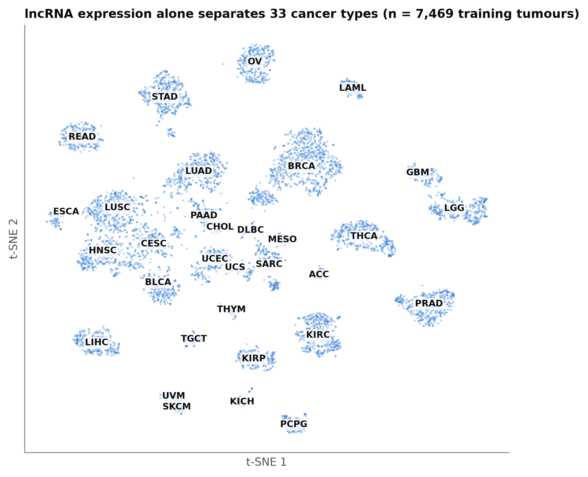</p>

### Benchmark (held-out test set, n = 1,868; bootstrap 95% CIs)

| Genes | Model | Macro-F1 | Balanced acc. | Top-3 acc. | Log-loss | ECE |
|---|---|---|---|---|---|---|
| lncRNA | Logistic regression | **0.946** (0.928–0.959) | **0.946** | 0.996 | **0.101** | 0.011 |
| lncRNA | XGBoost | 0.936 (0.918–0.949) | 0.939 | **0.997** | 0.121 | **0.008** |
| lncRNA | MLP (PyTorch) | 0.939 (0.922–0.952) | 0.942 | 0.996 | 0.160 | 0.051 |
| protein-coding | Logistic regression | 0.935 (0.914–0.951) | 0.937 | 0.995 | 0.108 | 0.006 |
| protein-coding | XGBoost | 0.926 (0.904–0.942) | 0.928 | 0.995 | 0.130 | 0.011 |
| protein-coding | MLP (PyTorch) | 0.922 (0.903–0.935) | 0.925 | 0.996 | 0.144 | 0.032 |

Each model uses the 2,000 most variable genes of its universe; hyperparameters were chosen by
5-fold CV on the training split only (`results/tables/search__*.json`).

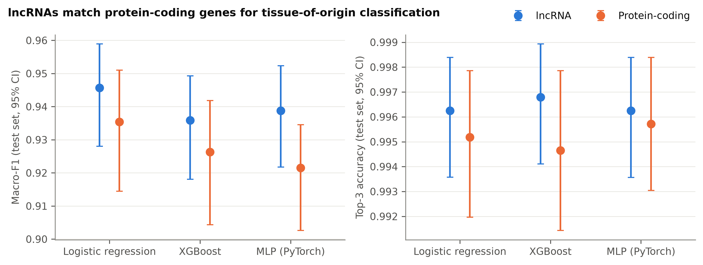

**The regularised linear model performs best.** With ~7,500 training tumours and features this
tissue-specific, XGBoost and the MLP add no accuracy, and the linear model is also the best
calibrated. The MLP's higher ECE is mostly
label smoothing, which softens its probabilities on purpose.

### Where the errors are

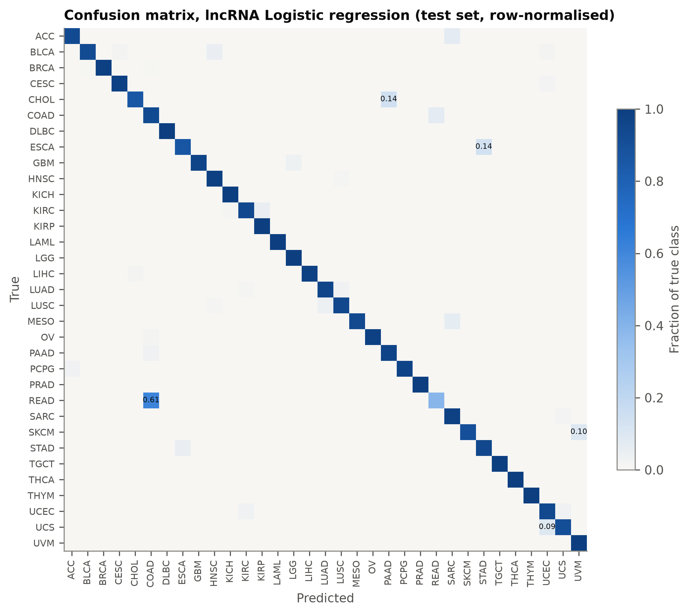

Almost all errors fall between cancers that share a tissue or cell of origin: **rectum vs
colon** (READ is mostly called COAD; TCGA found non-hypermutated colon and rectal cancers to be
molecularly indistinguishable, [TCGA Network, 2012](https://doi.org/10.1038/nature11252)),
oesophagus vs stomach, cholangiocarcinoma vs pancreas, and uterine carcinosarcoma vs
endometrial carcinoma. The same pairs are the hardest for protein-coding models (below), so
they reflect biology rather than a weakness specific to lncRNAs.

<p align="center">
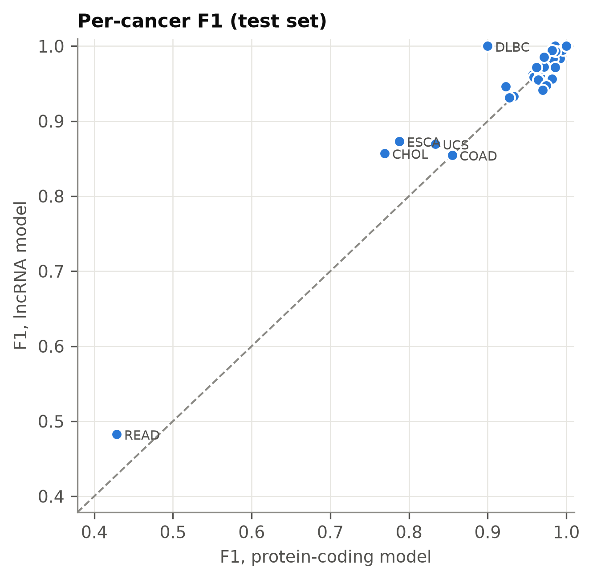
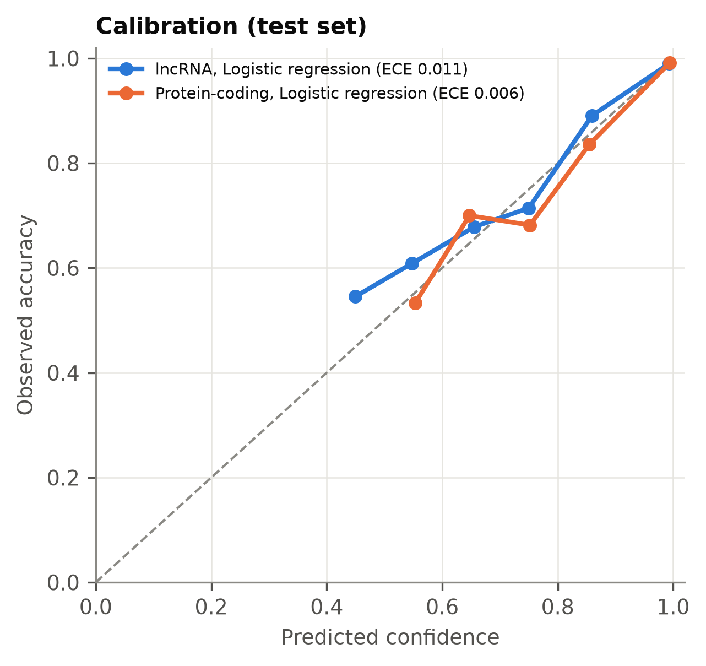
</p>

### How many lncRNAs are needed?

<p align="center">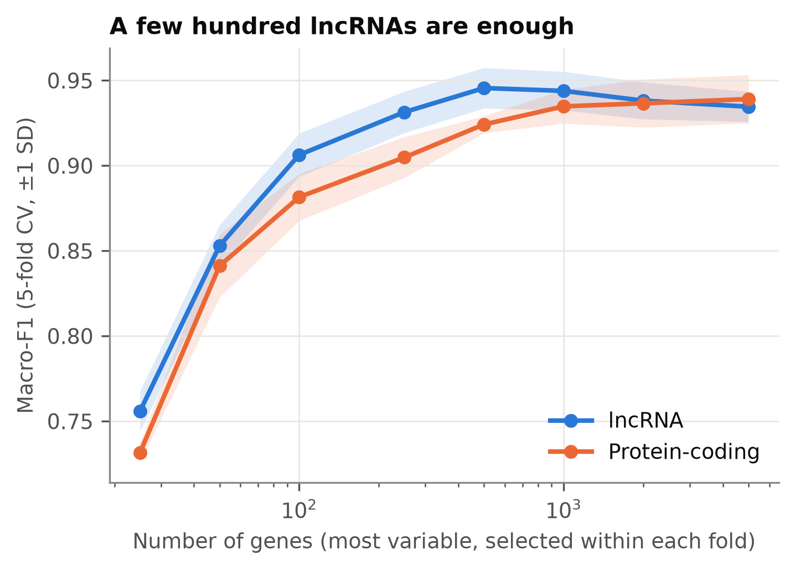</p>

Performance saturates at ~500 lncRNAs. At every budget up to 500 genes, lncRNAs beat the
same number of protein-coding genes, which suggests that a compact lncRNA panel could carry
most of the tissue-of-origin signal.

Choosing the genes for the task rather than by variance (`scripts/16_sparse_panel.py`: L1
selection, then an L2 refit on the selected genes so that the score is not inflated by the
shrinkage that chose them) does not produce a panel of a few dozen. 70 genes give macro-F1
0.85 on the test split and 67% on the metastases; 154 give 0.91 and 82%; the first panel
within two points of the full model has 376 genes (0.93, 92% on the metastases). A targeted
assay would therefore need a few hundred lncRNAs, not tens. The 376-gene panel is in
`results/tables/sparse_panel_genes.csv` with the cancer types each gene serves.

<p align="center">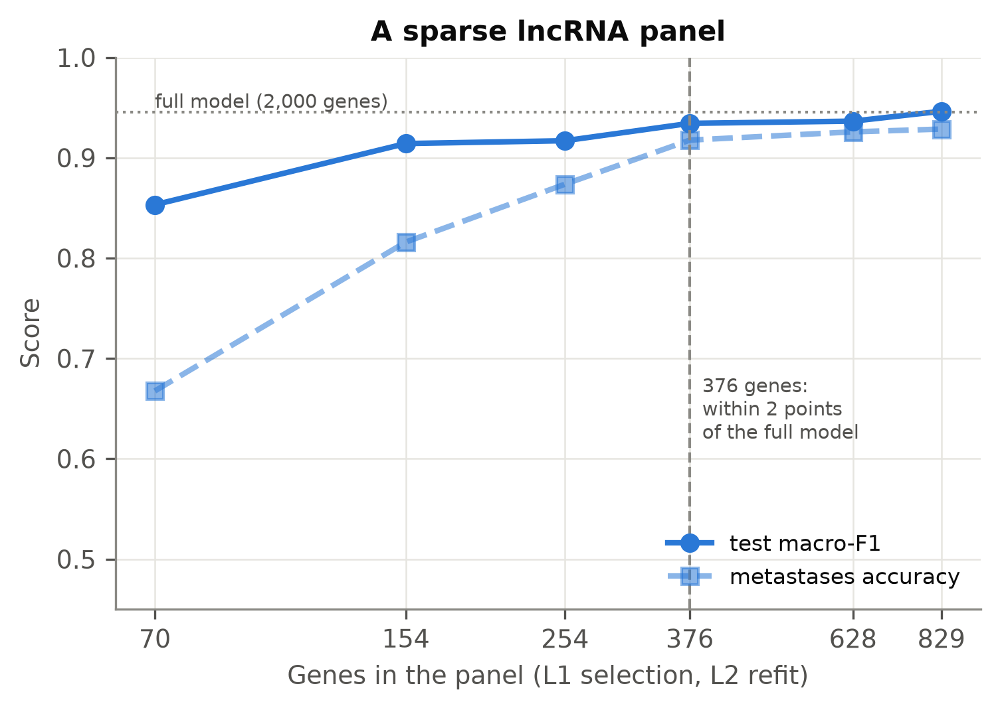</p>

### Generalisation to metastases

364 TCGA melanoma metastases (lymph node, skin and distant sites) from patients whose primary
tumour was *not* in the cohort were classified by models trained only on primary tumours:

| Genes | Model | Accuracy (95% CI) | Top-3 accuracy |
|---|---|---|---|
| lncRNA | Logistic regression | 0.929 (0.904–0.953) | 0.964 |
| lncRNA | MLP (PyTorch) | **0.934** (0.909–0.959) | **0.973** |
| lncRNA | XGBoost | 0.901 (0.871–0.931) | 0.951 |
| protein-coding | Logistic regression | 0.901 (0.871–0.931) | 0.967 |
| protein-coding | MLP (PyTorch) | 0.920 (0.893–0.948) | 0.970 |
| protein-coding | XGBoost | 0.890 (0.857–0.920) | 0.967 |

Most errors are calls of sarcoma or uveal melanoma, which is consistent with dedifferentiated
melanomas and with a shared melanocytic lineage.

### Marker lncRNAs (SHAP)

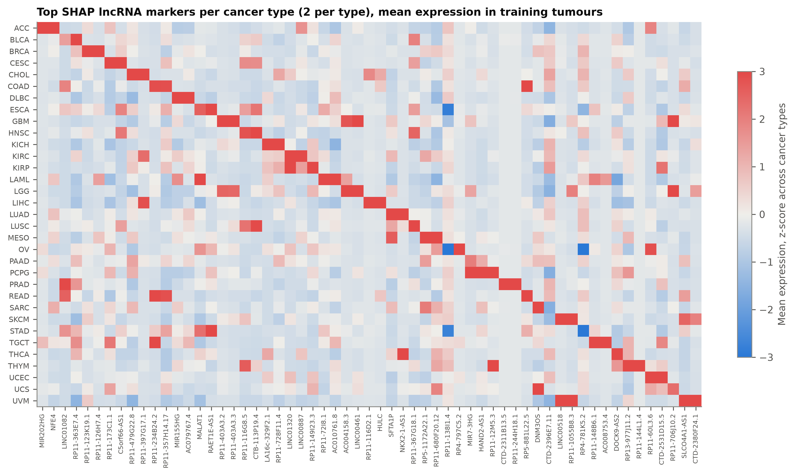

Per-cancer SHAP rankings are in [`results/tables/shap_markers_per_cancer.csv`](results/tables/shap_markers_per_cancer.csv).
Many of the top markers are antisense transcripts of lineage transcription factors
(*HAND2-AS1*, *NKX2-1-AS1*, *EMX2OS*, *DLX6-AS1*), which fits the view of lncRNAs as
cell-identity genes.

How much of a marker list survives a change of training sample? Refitting the logistic
regression on 30 bootstrap resamples of the training split (`scripts/14_marker_stability.py`)
and comparing each resample's ten largest coefficients per cancer type with the full-data
list gives a Jaccard overlap of 0.34 (COAD) to 0.82 (THCA), 0.54 on average. 111 of the 330
full-data markers are recovered in at least 90% of resamples, and 122 are also in the SHAP
top ten of the XGBoost model. The stable, model-independent markers are the ones worth
reading biology into; the rest are interchangeable members of correlated groups.

<p align="center">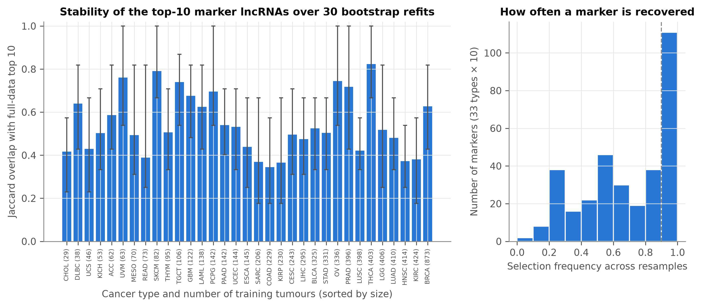</p>


### Does removing chrX/chrY genes matter? (ablation)

I excluded sex-chromosome genes up front, because *XIST* (itself a lncRNA) and the
Y-linked transcripts would let a model spot ovarian, uterine or prostate cancer from the
patient's sex rather than from the tissue. That was an assumption, so I tested it
(`scripts/07_ablation_sex_chromosomes.py`): add the 341 chrX/chrY lncRNAs back and retrain the
same logistic regression.

| Genes | Test macro-F1 (95% CI) |
|---|---|
| autosomal lncRNAs (main analysis) | 0.946 (0.928–0.959) |
| + chrX/chrY lncRNAs | 0.943 (0.926–0.957) |

Given the chance, the model *does* take the shortcut: **XIST becomes the 2nd most heavily
weighted of its 2,000 features** and the Y-linked *TTTY14* the 12th. But accuracy doesn't
improve, including for the sex-specific cancers (OV, UCEC, UCS, CESC, PRAD, TGCT). The sex
signal is redundant with tissue signal the autosomal lncRNAs already carry, so excluding it
costs nothing and keeps the model's explanations about tissue biology.

## Approach

```
TCGA RNA-seq (Toil / UCSC Xena, 10,535 samples x 60,498 genes)
        │  GENCODE v23 biotypes → 14,043 lncRNAs | 18,907 protein-coding genes (autosomal)
        │  primary tumours, one sample per patient → 9,337 tumours, 33 cancer types
        ▼
stratified 80/20 split (train 7,469 | test 1,868)   +   external: 364 metastases (unseen patients)
        ▼
Pipeline( top-2,000-variance genes  →  [scale]  →  classifier )   ← selection refit in every fold
        │  classifiers: L2 logistic regression · XGBoost · PyTorch MLP
        │  hyperparameters: grid search, 5-fold stratified CV on the training split (macro-F1)
        ▼
held-out test set: macro-F1, balanced accuracy, top-3 accuracy, log-loss, ECE (bootstrap 95% CIs)
        ▼
SHAP (TreeExplainer) → marker lncRNAs per cancer type
```

Design decisions that matter for a trustworthy estimate:

- **No patient in two places.** One sample per patient; the external metastases come only from
  patients with no primary tumour in the cohort.
- **No selection leakage.** Feature selection is the first step of each scikit-learn
  `Pipeline`, so within cross-validation it only ever sees the training folds.
- **No sex shortcut.** Genes on chrX/chrY are removed, so models cannot identify ovarian,
  uterine, prostate or testicular tumours from patient sex (XIST is itself a lncRNA).
- **The test set is not used for tuning** the models: hyperparameters are chosen on the
  training split, and every test metric carries a bootstrap 95% confidence interval. One
  exception: the size of the sparse panel (`scripts/16_sparse_panel.py`) is read off test
  macro-F1, so that panel's test score is optimistic.
  The robustness analyses (learning curve, ablation, admixture, subgroups) score the same
  test set again, so their results are descriptive, not independent confirmations.
- **Calibration is reported**, not just accuracy: a tissue-of-origin call is only useful
  clinically if its confidence can be trusted.

## Uncertainty and robustness

The analyses in this section ask where the classifier should not be trusted.
Full numbers are in [`MODEL_CARD.md`](MODEL_CARD.md).

**Prediction sets with a guarantee** (`scripts/08_conformal.py`). Split conformal prediction
turns the probabilities into a set of candidate cancer types per tumour with a stated error
rate, using 15% of the training split as a calibration set. At α = 0.10 with one global
threshold, 90.7% of test tumours get a single cancer type and 9.3% get an empty set, which is
an abstention; 98.8% of the non-empty sets contain the true type. The same threshold covers
only 76% of the external melanoma metastases: a global guarantee does not survive a
distribution shift. One threshold per class restores coverage (0.945 on the metastases) at
the cost of sets of about five types, because rare classes have few calibration samples.
The choice of score matters as much as the threshold. The adaptive score (APS) in its
deterministic form gives sets of 14 types on average and, worse, an empty set to exactly
the tumours the model is most certain about, because a confidently correct prediction gets
a score near 1. With the randomised score (one uniform draw per tumour) APS gives 1.06
types, covers 90% of the test tumours and, unlike LAC, 94% of the external metastases with
a single global threshold. Its regularised form (RAPS, penalty chosen on 30% of the
calibration set) gives 0.96 types and 91% on the metastases. `lncpan predict --score raps`
uses these thresholds.

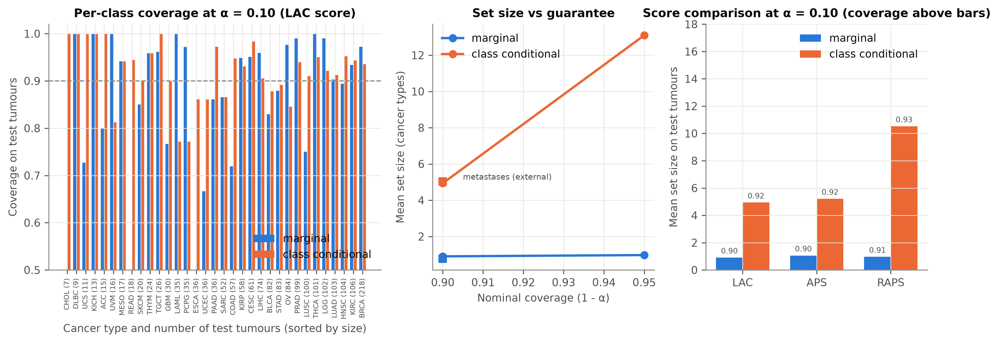

**Subgroups** (`scripts/09_subgroups.py`). Accuracy is the same for women and men and across
age groups. It is lower for stage III and IV tumours (0.931 and 0.949, against 0.969 and 0.970
for stages I and II; intervals overlap) and
clearly lower for cancer types with fewer than 100 training tumours: 0.887 against 0.975 for
types with 300 or more, with an expected calibration error of 0.073 against 0.009. Rare
classes are where the model is both less accurate and over-confident.

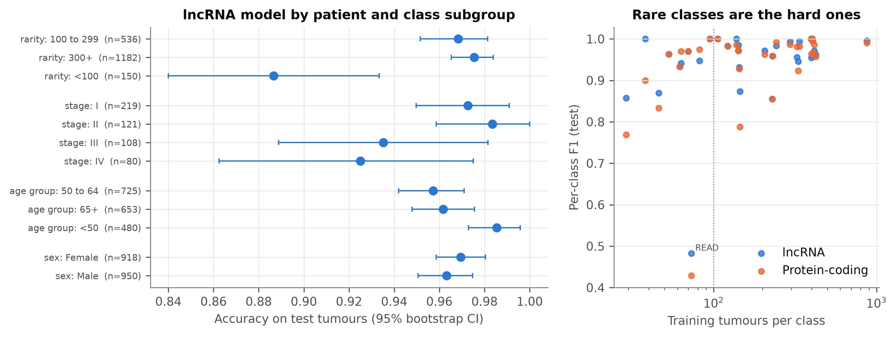

**Learning curve** (`scripts/10_learning_curve.py`). With 746 training tumours (10%), the
lncRNA model already reaches macro-F1 0.895 and the protein-coding model 0.878; the gap in
favour of lncRNAs holds at every training-set size.

<p align="center">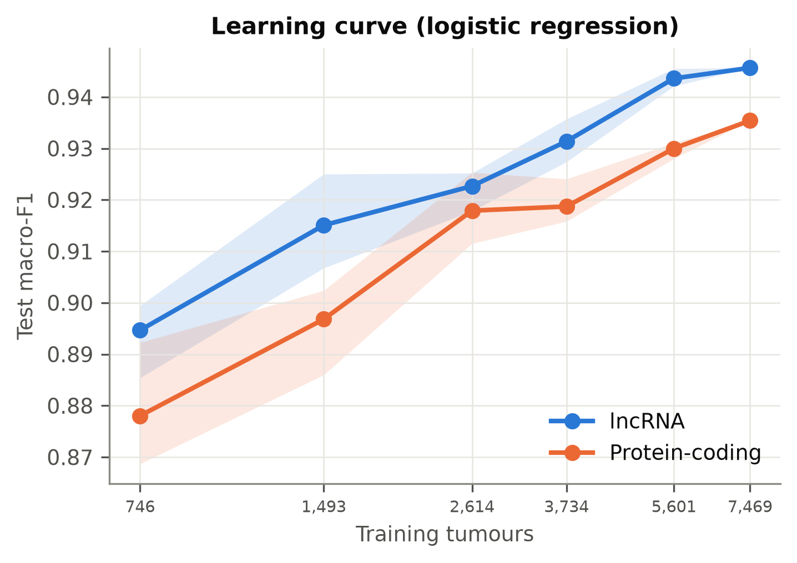</p>

**Unseen hospital sites** (`scripts/11_site_holdout.py`). TCGA barcodes name the tissue
source site, and random cross-validation lets the same hospital appear in training and test
folds. Cross-validating the training split with every site kept in a single fold lowers
macro-F1 from 0.938 to 0.895 for the lncRNA model and from 0.937 to 0.894 for the
protein-coding model: about four points is the cost of moving to a centre the model has never
seen, and it is the same for both gene sets.

<p align="center">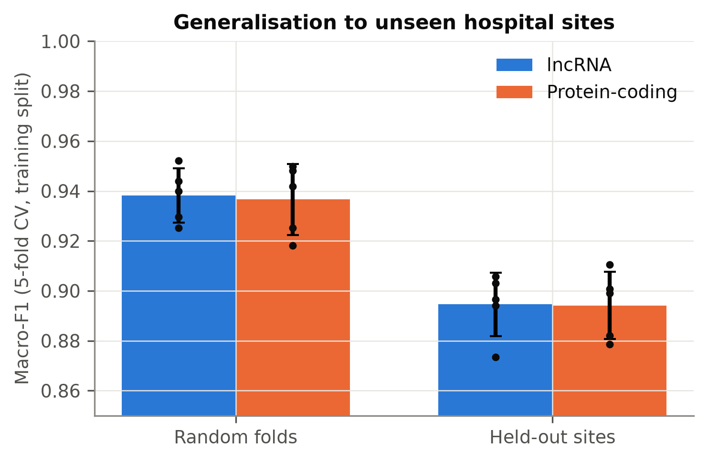</p>

The site signal itself can be measured (`scripts/15_site_signal.py`): within a cancer type,
predicting which hospital a tumour came from, for the 18 types with at least three sites of
15 or more tumours, gives a balanced accuracy of 0.42 for lncRNAs and 0.37 for protein-coding
genes against 0.18 by chance. Both gene sets carry a hospital signature, and lncRNAs carry
slightly more of it, so the equal cost of unseen sites above is not because lncRNAs are free
of batch effects.

<p align="center">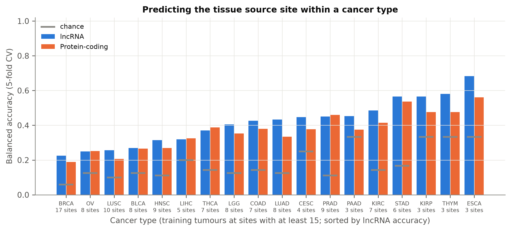</p>

**External validation on MET500** (`scripts/12_met500.py`). MET500 (Robinson et al., 2017)
holds RNA-seq of 437 patients' metastatic biopsies with the primary site recorded, from
another institution, with capture and poly-A libraries and FPKM quantification. Its public
matrix contains none of the 14,043 lncRNAs in this project's universe, so the lncRNA model
cannot be tested on it: with every lncRNA missing its input carries no information, its
conformal sets are all empty and its top-1 accuracy is at chance. The protein-coding model,
with 18,196 of its 18,907 genes present, recovers the primary site of 66% of patients
(95% CI 61 to 71%) and places it in the top three for 82%, against 96% and 99.5% on the
TCGA test split. Poly-A and capture libraries score alike (67% and 63%). Two lessons: a
lncRNA classifier is only usable where the quantification pipeline reports lncRNAs, and an
independent metastatic cohort costs the coding model about a third of its accuracy.

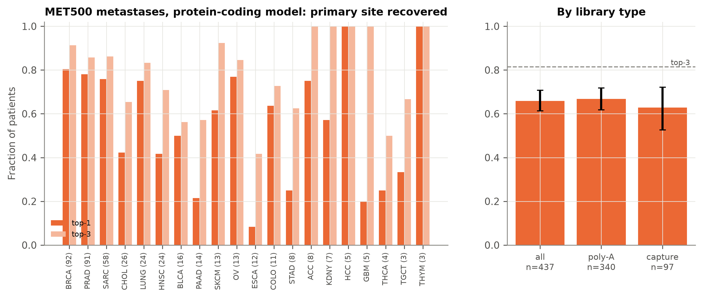

**Calibration and biopsy site on MET500** (`scripts/13_met500_calibration.py`). On the TCGA
test split the protein-coding model is well calibrated (expected calibration error 0.012);
on MET500 it is over-confident (mean confidence 0.79 against 0.66 accuracy, ECE 0.126).
Temperature scaling fitted on held-out TCGA tumours, the standard remedy, finds a
temperature of 1.18 and lowers the MET500 error only to 0.103: a calibration set from the
source distribution cannot anticipate a shift. Splitting MET500 by where the metastasis was
sampled explains much of the loss. Lymph node, soft tissue and bone marrow biopsies are
classified correctly for 73 to 78% of patients, but liver biopsies only for 49%, and 37% of
them are called liver or bile duct cancer, which is the host tissue rather than the primary.
Lung biopsies show the same pattern (54% correct, 34% called lung cancer). A metastasis
carries the expression of the organ it grows in, and the classifier has no way to tell the
two apart.

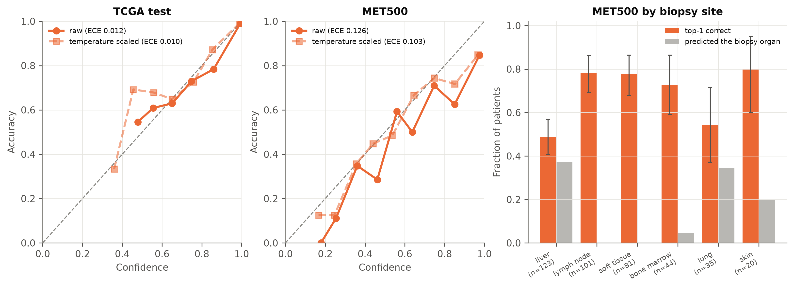

**Tumour or neighbourhood? Immune and stromal admixture** (`scripts/17_microenvironment.py`).
Bulk tissue mixes tumour cells with stroma and immune cells, so a tissue-of-origin model could
be reading the neighbourhood rather than the tumour. Each tumour gets an immune and a stromal
score, the mean z-score of eight canonical leukocyte genes (PTPRC, CD2, CD3E, CD53, LAPTM5,
CORO1A, CD68, CD14) and eight fibroblast and matrix genes (COL1A1, COL1A2, COL3A1, COL5A1, DCN,
LUM, FAP, PDGFRB), a transparent stand-in for ESTIMATE
([Yoshihara et al., 2013](https://doi.org/10.1038/ncomms3612)), standardised within cancer type
because stroma is part of what distinguishes the types.

| | Immune score | Stromal score |
|---|---|---|
| Misclassified minus correct, median (95% CI), 63 vs 1,805 test tumours | −0.13 (−0.57 to 0.16), p = 0.18 | −0.16 (−0.37 to 0.21), p = 0.61 |
| Error rate in the low / middle / high tertile | 4.3% / 2.9% / 2.9% | 3.2% / 3.9% / 3.1% |
| Spearman correlation with the model's confidence, 1,868 tumours | −0.06 | −0.05 |

The classifier's mistakes are not tumours swamped by stroma or immune cells, and its confidence
barely moves with either (the correlations are detectable only because n is large). The
markers tell a more mixed story: 17 of the 330 top-10 SHAP markers (5%) correlate at
|ρ| ≥ 0.5 with the immune or stromal score inside their own cancer type
(`results/tables/microenvironment_markers.csv`). Examples are *HAND2-AS1* for pancreatic and
stomach cancer (stromal ρ 0.53 and 0.61) and two breast-cancer markers that track stroma at
ρ ≈ 0.8, so part of what the model uses for those types is the tissue around the tumour. One
thymoma marker, *TRBV11-2*, is named as a T-cell receptor β variable segment but is typed
`lincRNA` in GENCODE v23; it is the only such gene in the 14,043-gene universe, and its
correlation with the immune score (ρ 0.78) says it reports the lymphocytes of thymoma, not
lncRNA biology. These are correlations within each type, with a marker-gene proxy rather than
a purity estimate from DNA, so they flag candidates for the single-cell check in "What I would
do next" rather than settle the question.

## Reproduce

Requires [uv](https://docs.astral.sh/uv/) and ~3 GB of disk. On macOS, XGBoost needs
`brew install libomp`.

```bash
uv sync
make data       # download TCGA (UCSC Xena) + GENCODE v23          (~750 MB)
make all        # prepare, benchmark, budget, interpret, external, figures, ablation, conformal, subgroups, curve, sites, met500, met500-calibration, markers, site-signal, panel
make test       # unit tests
```

Every step reads `configs/default.yaml`; changing the seed, split, feature budget or
hyperparameter grids needs no code changes. On an Apple M-series laptop the full pipeline runs
in about 45 minutes, most of it XGBoost tuning.

### Predict new samples

`scripts/08_conformal.py` saves the refit model and its calibration thresholds; `lncpan predict`
applies them to a samples x genes table of log2(TPM + 1) lncRNA expression (Ensembl IDs):

```bash
uv run lncpan predict new_samples.parquet --alpha 0.1            # one global threshold
uv run lncpan predict new_samples.parquet --alpha 0.1 --class-conditional
```

Each row gets the predicted cancer type, its probability and the conformal set; an empty set
means the model abstains.

### Docker

```bash
make docker      # builds the image and runs the tests inside it; data/ and results/ are mounted
```

### Seed stability (Nextflow)

The benchmark above is one training seed. `main.nf` reruns it over several seeds, with each
gene universe x model x seed as its own Nextflow task, and pools the runs with
`scripts/18_seed_stability.py`. The test split stays fixed; the seed changes the CV folds, the
model initialisation and the bootstrap. What this adds over the Makefile:

- independent runs execute in parallel, each limited to its own cores (XGBoost and joblib are
  told how many), while the MLP runs one task at a time because they share the GPU;
- `-resume` caches every task by its inputs, so adding a seed or a model only runs the new
  tasks, and editing a script reruns only the tasks that used it;
- a task killed for memory is retried with more; per-task timings go to
  `results/nextflow/pipeline_info/`.

```bash
mamba env create -f envs/nextflow.yml                   # Nextflow + Java 21
mamba run -n nextflow nextflow run . -profile test      # synthetic data, about 2 minutes
mamba run -n nextflow nextflow run . --models logreg    # real data, 5 seeds, about 2 minutes
mamba run -n nextflow nextflow run .                    # all models, about 85 min on an M5 Pro
```

Macro-F1 over seeds 42 to 46 (`results/nextflow/seed_stability/`); seed 42 reproduces the
benchmark table above:

| Genes | Model | Mean | SD over seeds | Range | SD / CI half-width |
|---|---|---|---|---|---|
| lncRNA | Logistic regression | 0.9457 | 0.0001 | 0.9457–0.9458 | 0.004 |
| lncRNA | XGBoost | 0.9401 | 0.0035 | 0.9359–0.9442 | 0.23 |
| lncRNA | MLP | 0.9397 | 0.0091 | 0.9300–0.9536 | 0.59 |
| protein-coding | Logistic regression | 0.9349 | 0.0012 | 0.9328–0.9354 | 0.07 |
| protein-coding | XGBoost | 0.9260 | 0.0033 | 0.9211–0.9298 | 0.18 |
| protein-coding | MLP | 0.9322 | 0.0065 | 0.9215–0.9372 | 0.39 |

Logistic regression stays the best model on average and barely moves with the seed. The MLP
moves most: its lncRNA range is 2.4 points wide and its best seed beats logistic regression,
so a single-seed comparison of the neural network is not reliable. Seed spread is below the
test-set bootstrap CI half-width for every model, so the intervals in the benchmark table
are dominated by test-set sampling. The lncRNA minus protein-coding gap is positive for all
five seeds with logistic regression (+0.010 to +0.013) and XGBoost (+0.010 to +0.019); with
the MLP it changes sign once (−0.006 to +0.023).

## Repository layout

```
configs/default.yaml        all experiment settings
src/lncpan/
  annotation.py             GENCODE parsing, lncRNA / protein-coding gene universes
  data.py                   TCGA barcode handling, sample selection, streaming matrix loader
  features.py               TopVarianceSelector (leakage-safe, scikit-learn compatible)
  mlp.py                    PyTorch MLP as a scikit-learn classifier (MPS/CUDA/CPU)
  models.py                 model factory + hyperparameter grids
  evaluate.py               metrics, expected calibration error, bootstrap CIs
  conformal.py              LAC, APS and RAPS prediction sets, marginal and per-class thresholds
  calibration.py            temperature scaling, reliability curves
  cli.py                    `lncpan predict`
  isolation.py              per-model process isolation (see note below)
scripts/01…17_*.py          pipeline steps and the analyses above (wired into the Makefile)
scripts/18_seed_stability.py  pools benchmark runs over seeds
main.nf, modules/, nextflow.config  Nextflow seed-stability pipeline (profiles: default, test)
tests/                      pytest suite, run in CI
results/tables, figures     all numbers and figures shown in this README
```

*Implementation note.* On macOS, XGBoost links Homebrew's OpenMP while PyTorch bundles its
own; the two runtimes crash when loaded into one process. Models are therefore imported lazily
and each is trained in its own spawned process (`lncpan/isolation.py`).

## What I would do next

1. **Validation on true cancers of unknown primary.** MET500 tests a change of centre and
   platform on metastases with a known primary; a CUP series with a later-confirmed origin,
   quantified with a pipeline that reports lncRNAs, is the test that matters.
2. **A panel with the biopsy organ in mind.** The sparse-panel experiment shows a few
   hundred lncRNAs are needed; the next question is whether a panel trained with metastatic
   samples and their biopsy site as a covariate stops reading the host organ (MET500 liver
   result above).
3. **Single-cell resolution.** Checking the top markers in scRNA-seq atlases would separate
   tumour-intrinsic lncRNAs from those that report the surrounding normal tissue.

## Limitations

- **Single consortium.** All tumours come from TCGA; although processed uniformly, centre and
  batch effects may inflate within-TCGA performance. Validation on an independent cohort,
  ideally true cancers of unknown primary, is the necessary next step.
- **External set covers one cancer type.** Only melanoma had enough metastases from patients
  without a primary sample, so the metastasis result shows transfer for one lineage, not all 33.
- **Bulk tissue.** Expression mixes tumour, stroma and immune cells; part of the signal is the
  tissue micro-environment rather than tumour-intrinsic lncRNA expression.
- **Short-read annotation.** GENCODE v23 lncRNA models are incomplete; unannotated or
  low-coverage lncRNAs are not captured by gene-level TPM.
- **Attribution is not mechanism.** SHAP ranks genes that the model uses; correlated genes share
  credit, and a high SHAP value does not imply a functional role. About a third of the top-10
  markers change between bootstrap refits.

## Data and references

- Expression: TCGA, re-processed with the Toil pipeline ([Vivian et al., 2017](https://doi.org/10.1038/nbt.3772)),
  obtained from UCSC Xena ([Goldman et al., 2020](https://doi.org/10.1038/s41587-020-0546-8)).
- Clinical labels: TCGA Pan-Cancer Clinical Data Resource ([Liu et al., 2018](https://doi.org/10.1016/j.cell.2018.02.052)).
- Gene annotation: GENCODE v23 ([Frankish et al., 2019](https://doi.org/10.1093/nar/gky955)).
- XGBoost ([Chen & Guestrin, 2016](https://doi.org/10.1145/2939672.2939785));
  SHAP for trees ([Lundberg et al., 2020](https://doi.org/10.1038/s42256-019-0138-9)).

The results shown here are based upon data generated by the TCGA Research Network:
https://www.cancer.gov/tcga.

## License

MIT © 2026 Matin Gerami
